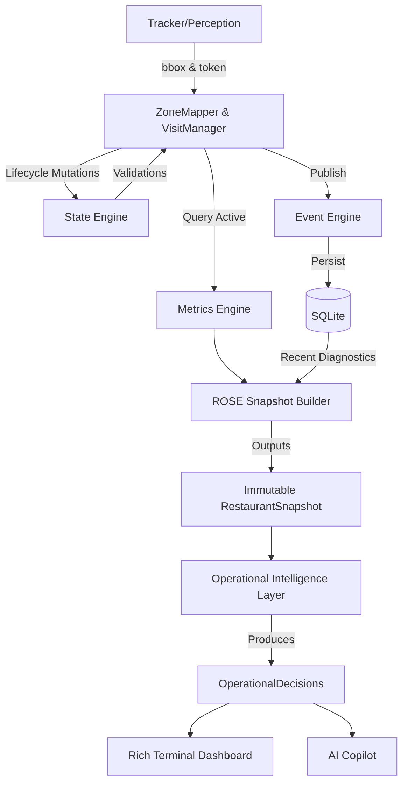

# Architecture

Aurika employs a strictly decoupled, event-driven architecture. The core philosophy is:
**Perception must never compute business logic. Decisions must never mutate perception.**

## 1. The Observe Layer
- **YOLOv8 & Tracking**: Converts pixels into bounding boxes and track IDs.
- **ZoneMapper**: Translates bounding boxes into semantic location names.

## 2. The Evaluate Layer
- **Visit Manager**: The core domain model. It wraps a track ID into a `Visit` object, managing its lifecycle and state history.
- **State Engine**: A strictly validated finite-state machine (FSM). It prevents illegal transitions (e.g., WAITING -> EXITED without passing through a terminal or intermediate logical state).
- **Metrics Engine**: Extracts business KPIs (Wait Times, Occupancy) from the active visits without touching raw tracks.
- **ROSE (Restaurant Operational State Engine)**: Aggregates all metrics, active visits, and system diagnostics into one immutable `RestaurantSnapshot`.

## 3. The Decide & Communicate Layer
- **Operational Intelligence Layer**: Consumes the `RestaurantSnapshot`, evaluates it against `configs/rules.json`, and generates ranked `OperationalDecision` objects.
- **Dashboard & Copilot**: Presentation layers that only read data. The AI Copilot uses structured `OperationalDecision` metrics to generate explanations, ensuring zero hallucinations.

## Dependency Graph

